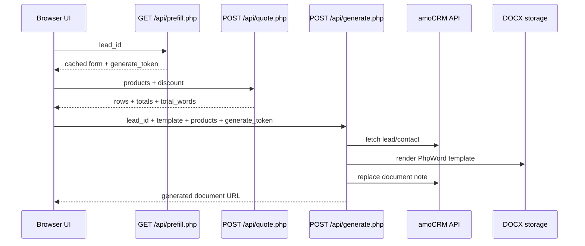
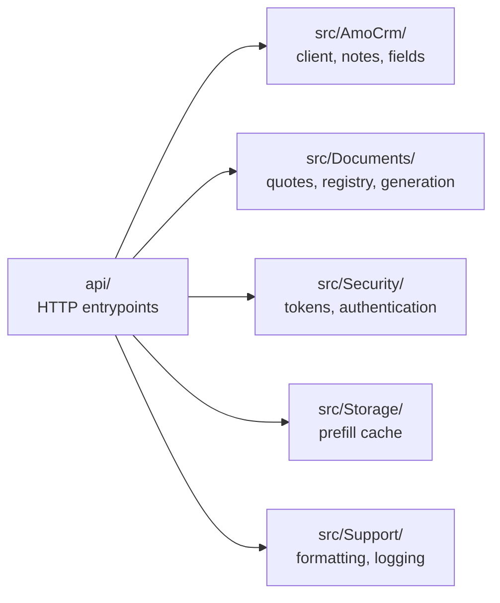

<p align="center">
  
</p>

<h1 align="center">⚡ AmoDocsEngine</h1>

<p align="center">
  <strong>Shared-hosting friendly amoCRM document generation engine for DOCX orders, acts, and custom templates.</strong>
</p>

<p align="center">
  <a href=".github/workflows/php-ci.yml"></a>
  
  
  
  <a href="LICENSE"></a>
</p>

<p align="center">
  <a href="docs/en/index.md">🇬🇧 English docs</a> ·
  <a href="docs/ru/index.md">🇷🇺 Документация</a> ·
  <a href="docs/en/api.md">🔌 API</a> ·
  <a href="SECURITY.md">🛡️ Security</a> ·
  <a href="CONTRIBUTING.md">🤝 Contributing</a> ·
  <a href="CODE_OF_CONDUCT.md">📜 Code of Conduct</a>
</p>

---

## ✨ What It Does

AmoDocsEngine connects a small browser UI to amoCRM and generates `.docx` documents from Word templates. It keeps the deployment simple enough for shared hosting while still separating OAuth, security, field mapping, quote calculation, template rendering, cache, notes, and logging into focused PHP services.

| Area | What is included |
| --- | --- |
| 🔐 Security | Server-issued `generate_token` for browser flow, optional HMAC mode for trusted server clients |
| 🧾 Documents | PhpWord template rendering for orders, acts, and config-driven custom templates |
| 📊 Totals | Backend-only quote calculation through `POST /api/quote.php` |
| 🔗 amoCRM | OAuth token refresh, lead/contact loading, document note replacement |
| 🗂️ Runtime | Prefill cache, generated documents, JSON logs, token storage |

## 🚀 Quick Start

```powershell
composer install
Copy-Item config/config.example.php config/config.php
.\vendor\bin\phpunit
```

Then fill `config/config.php`, run the amoCRM OAuth flow through `oauth.php?code=...`, and open:

```text
public/ui.html?lead_id=<amoCRM_LEAD_ID>
```

## 🧭 Docs Map

| Topic | English | Русский |
| --- | --- | --- |
| Start and deploy | [Getting started](docs/en/getting-started.md) | [Запуск](docs/ru/getting-started.md) |
| Configuration | [Configuration](docs/en/configuration.md) | [Конфигурация](docs/ru/configuration.md) |
| API contracts | [API](docs/en/api.md) | [API](docs/ru/api.md) |
| Word templates | [Templates](docs/en/templates.md) | [Шаблоны](docs/ru/templates.md) |
| Logs and migration | [Operations](docs/en/operations.md) | [Эксплуатация](docs/ru/operations.md) |
| Development | [Development](docs/en/development.md) | [Разработка](docs/ru/development.md) |

## 🏗️ Request Flow



Reusable diagram sources:

- [Architecture overview](docs/assets/architecture-overview.mmd)
- [Workflow overview](docs/assets/workflow-overview.mmd)

## 🧱 Module Boundaries



## 🧩 Main Endpoints

| Endpoint | Purpose |
| --- | --- |
| `GET /api/prefill.php?lead_id=` | Restore cached form data and issue `generate_token` |
| `POST /api/quote.php` | Calculate rows, totals, and amount in words |
| `POST /api/generate.php` | Validate request, fetch amoCRM data, generate DOCX, update note |

## 🧪 Verification

```powershell
.\vendor\bin\phpunit
```

Current suite covers URL routing, quote calculations, amoCRM client behavior, field ID mapping, template registry, security token validation, cache, notes, and logging.

## 🏷️ Repository Setup Tips

- **Description:** amoCRM document generation engine with OAuth, DOCX templates, secure browser flow, quote preview, and shared-hosting deployment.
- **Topics:** `php`, `amocrm`, `docx`, `phpword`, `crm`, `document-generation`.
- **Social preview:** upload `docs/assets/github-social-preview.png` in GitHub repository settings.
- **Community:** keep [Security](SECURITY.md), [Contributing](CONTRIBUTING.md), [Code of Conduct](CODE_OF_CONDUCT.md), and GitHub issue templates visible.

---

Made for pragmatic CRM document automation: small surface, clear modules, practical docs.
