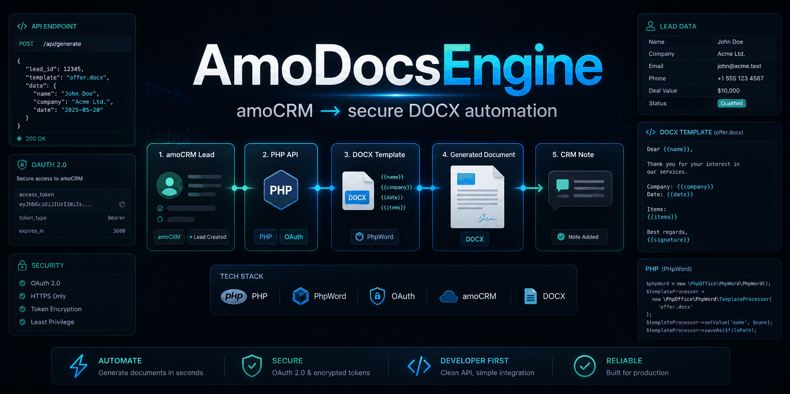
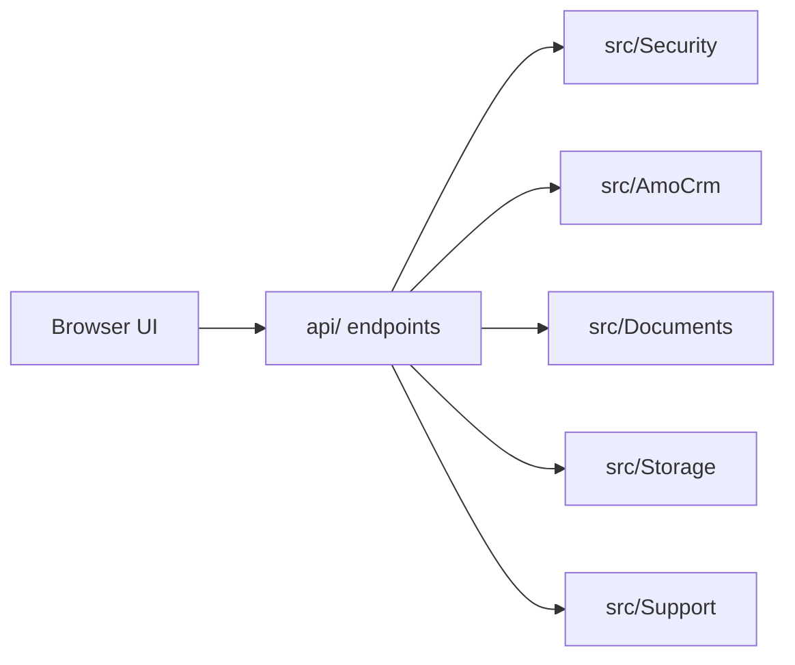
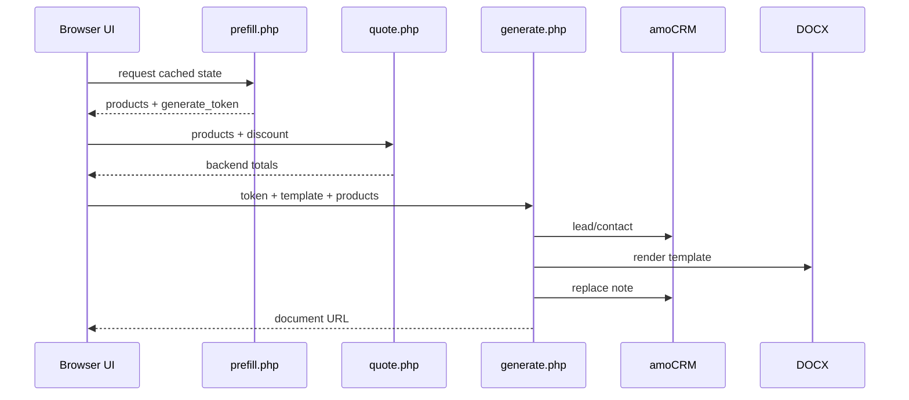

  

<h1 align="center">📚 AmoDocsEngine Documentation</h1>

  <strong>Install, configure, operate, and extend a secure amoCRM → DOCX automation engine.</strong>

  <a href="../../README.md">🏠 README</a> ·
  <a href="../ru/index.md">🇷🇺 Русский</a> ·
  <a href="api.md">🔌 API</a> ·
  <a href="../../SECURITY.md">🛡️ Security</a>

---

## 🧭 Navigation

| Section | Use it for |
| --- | --- |
| [🚀 Getting Started](getting-started.md) | Install dependencies, deploy files, run OAuth, open the UI |
| [⚙️ Configuration](configuration.md) | `config/config.php`, `amo_fields`, templates, security and paths |
| [🔌 API](api.md) | `prefill.php`, `quote.php`, `generate.php` request/response contracts |
| [🧾 Templates](templates.md) | DOCX placeholders, row cloning, adding new document templates |
| [🛠️ Operations](operations.md) | Logs, troubleshooting, migration, smoke tests |
| [🧪 Development](development.md) | Project structure, tests, local workflow, contribution checks |

## ⚡ Fast Route

1. Install dependencies with `composer install`.
2. Copy `config/config.example.php` to `config/config.php`.
3. Fill amoCRM OAuth credentials and `amo_fields` IDs.
4. Run OAuth through `oauth.php?code=...`.
5. Open `public/ui.html?lead_id=<ID>`.

## 🧩 Documentation Type Map

| Type | Pages |
| --- | --- |
| Tutorial | [Getting Started](getting-started.md) |
| How-to | [Configuration](configuration.md), [Templates](templates.md), [Operations](operations.md) |
| Reference | [API](api.md), [Development](development.md) |
| Explanation | Architecture and workflow sections below |

## 🏗️ Architecture Snapshot

The browser UI calls small PHP endpoints. Backend services handle request auth, quote calculation, amoCRM API calls, DOCX rendering, prefill cache, notes, and logs.

## 🔁 Generation Workflow

Diagram sources: [architecture](../assets/architecture-overview.mmd), [workflow](../assets/workflow-overview.mmd).

---

**Next:** [Getting Started](getting-started.md) · **Русский:** [Документация](../ru/index.md)
