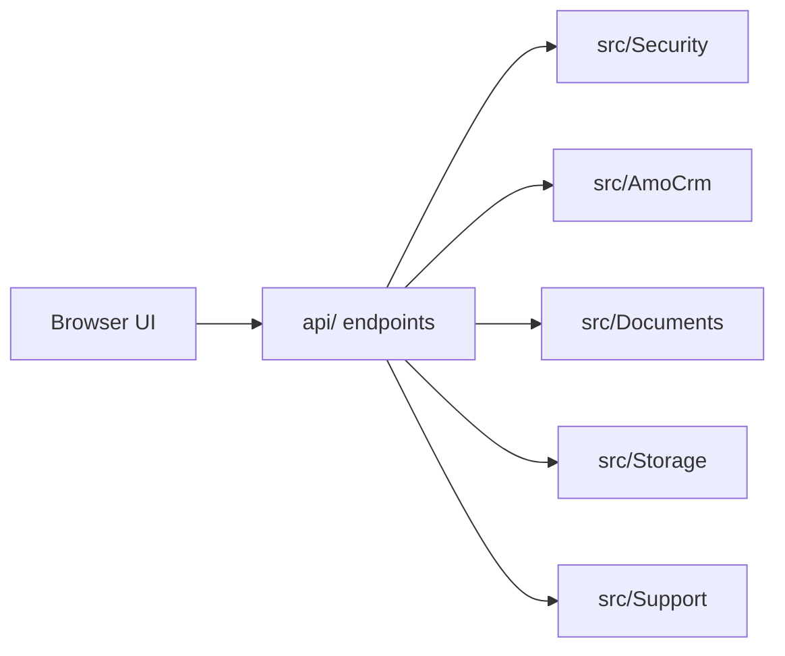
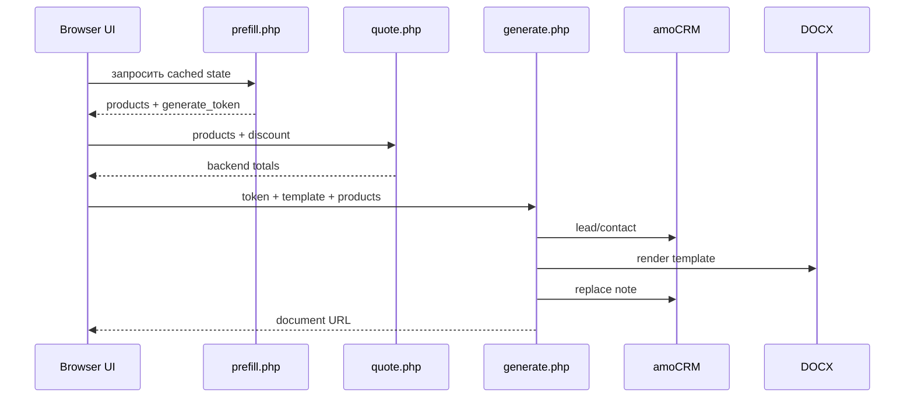

  

<h1 align="center">📚 Документация AmoDocsEngine</h1>

  <strong>Установка, настройка, эксплуатация и расширение secure amoCRM → DOCX automation engine.</strong>

  <a href="../../README.md">🏠 README</a> ·
  <a href="../en/index.md">🇬🇧 English</a> ·
  <a href="api.md">🔌 API</a> ·
  <a href="../../SECURITY.md">🛡️ Security</a>

---

## 🧭 Навигация

| Раздел | Для чего |
| --- | --- |
| [🚀 Запуск](getting-started.md) | Установить зависимости, развернуть файлы, пройти OAuth, открыть UI |
| [⚙️ Конфигурация](configuration.md) | `config/config.php`, `amo_fields`, шаблоны, безопасность и пути |
| [🔌 API](api.md) | Контракты `prefill.php`, `quote.php`, `generate.php` |
| [🧾 Шаблоны](templates.md) | DOCX-плейсхолдеры, строки таблицы, новые шаблоны |
| [🛠️ Эксплуатация](operations.md) | Логи, диагностика, миграция, smoke-тесты |
| [🧪 Разработка](development.md) | Структура проекта, тесты, локальный workflow |

## ⚡ Быстрый маршрут

1. Запустить: `composer install`.
2. Настроить: скопировать `config/config.example.php` в `config/config.php`.
3. Заполнить amoCRM OAuth и ID полей в `amo_fields`.
4. Проверить API через `quote.php`.
5. Разобрать ошибки через `logs/generate.log`.

## 🧩 Типы документации

| Тип | Страницы |
| --- | --- |
| Tutorial | [Запуск](getting-started.md) |
| How-to | [Конфигурация](configuration.md), [Шаблоны](templates.md), [Эксплуатация](operations.md) |
| Reference | [API](api.md), [Разработка](development.md) |
| Explanation | Архитектура и workflow ниже |

## 🏗️ Кратко об архитектуре

Browser UI вызывает небольшие PHP endpoints. Backend отвечает за авторизацию запроса, расчет сумм, amoCRM API, генерацию DOCX, кэш префилла, заметки и логи.

## 🔁 Workflow генерации

Исходники схем: [architecture](../assets/architecture-overview.mmd), [workflow](../assets/workflow-overview.mmd).

---

**Дальше:** [Запуск](getting-started.md) · **English:** [Documentation](../en/index.md)
